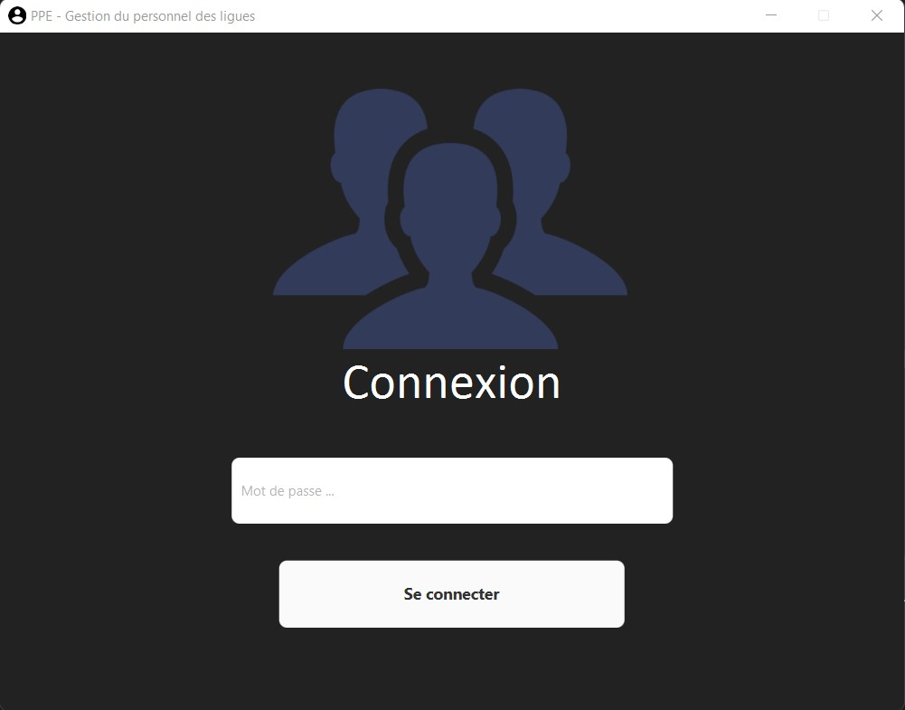
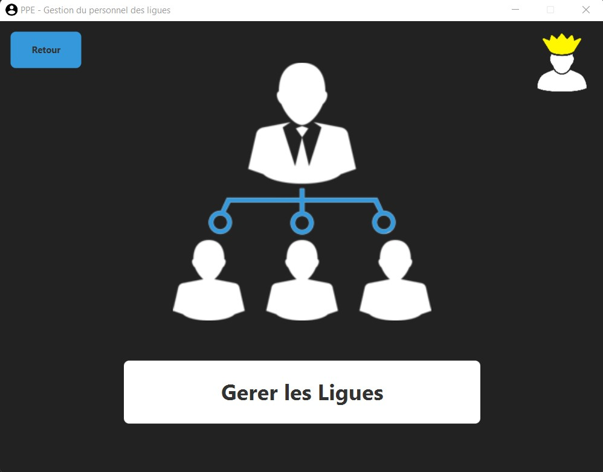
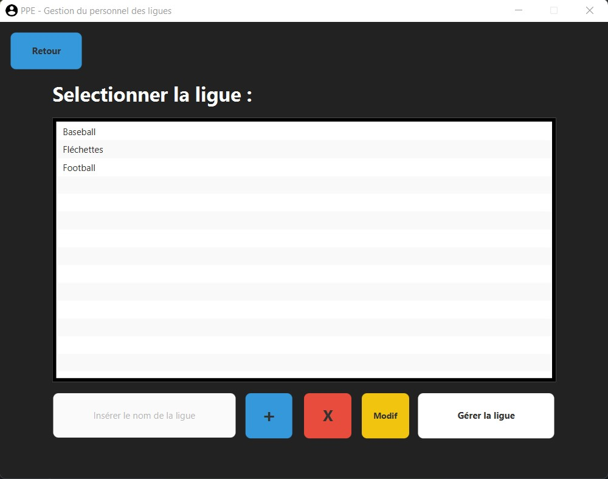
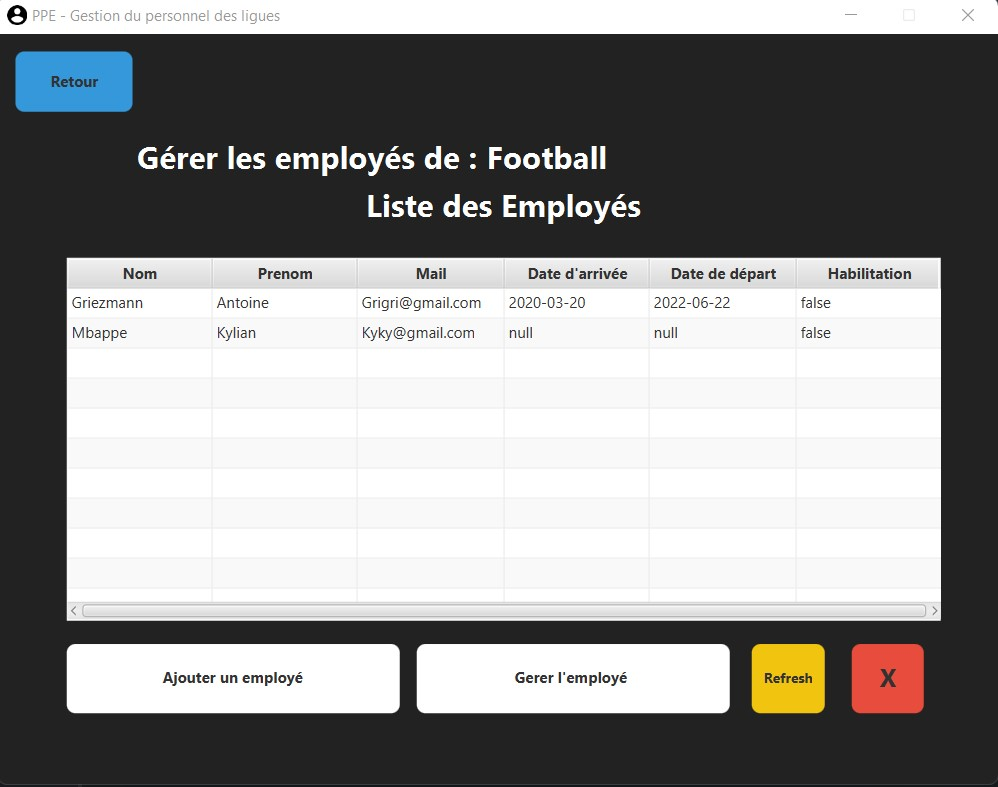
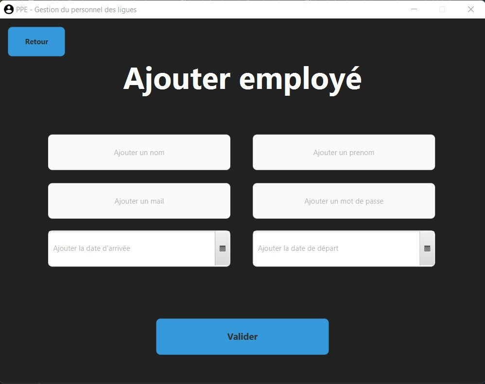
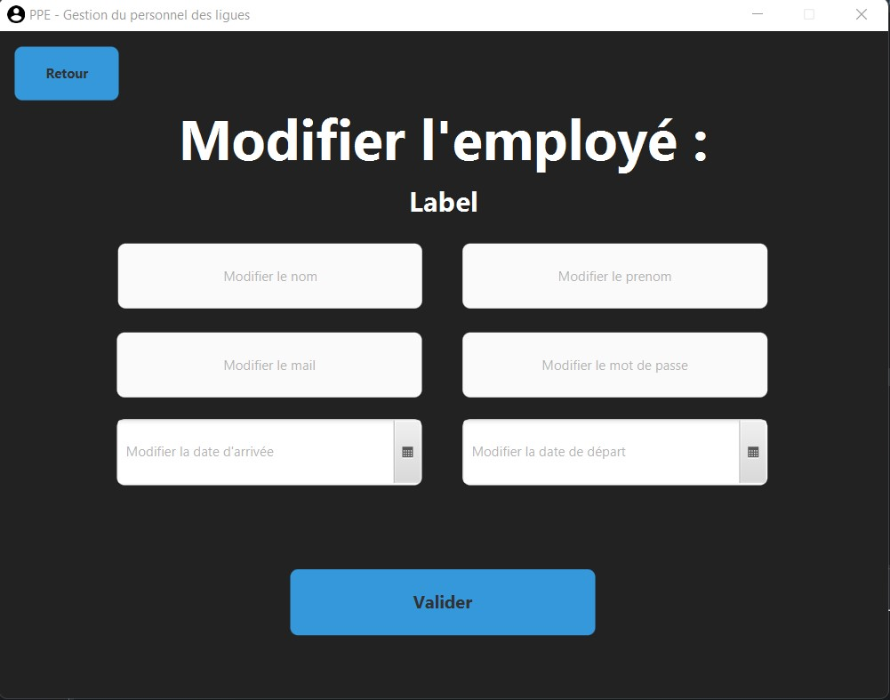
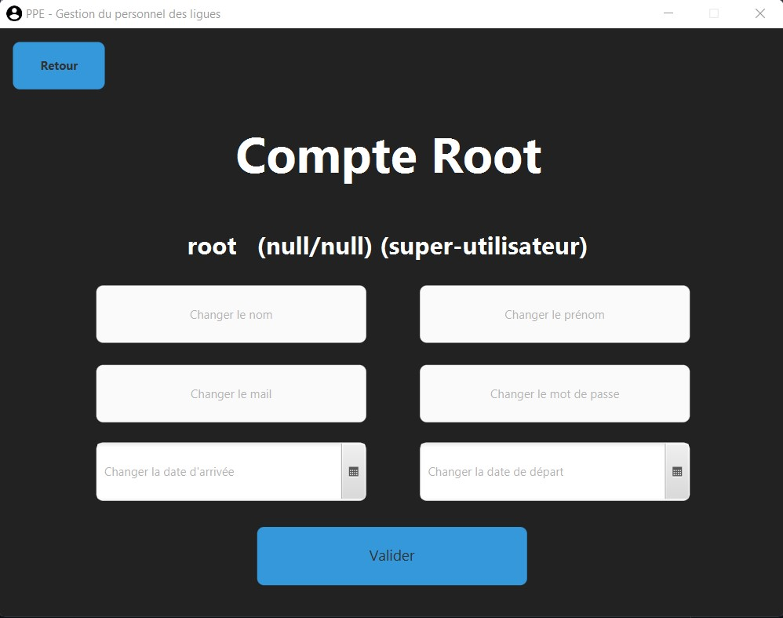

# Personnel - PROJET G   | BTS SIO SLAM2 |

## Documentation : [Voir la documentation pour les utilisateurs](https://docs.google.com/document/d/1_qO7ibMOx13M1dDFzYNhbIoGpmaUo_rbjf1XIRG6k0Y/edit)

## Groupe G:

-   Quentin([Tinou95](https://github.com/Tinou95))
-   Samuel([Samalairbien](https://github.com/Samalairbien))
-   Philippe([PhilDaiguille](https://github.com/Tinou95))

## Sommaire :

1. [Introduction](#Introduction)

2. [Fonctionnement](#Fonctionnement)

3. [Annexe_Développeur](#Annexe_Développeur)

# `Introduction`

Cette situation professionnelle est réalisée dans le contexte de la M2L ou Maison des ligues de Lorraine. Dans le but de gérer au mieux les différentes ligues et leurs employés, l’organisme dispose d’une application qui va permettre par le biais de son administrateur de recenser les employés de chaque ligue.

Un des responsables de la M2L, utilise une application pour gérer les employés des ligues. L’application est mise à votre disposition par le biais des ressources suivantes :

    - Le code source sur Github.
    - La documentation.
    - Une bibliothèque logiciel de dialogue en ligne de commande, disponible dans ce dépôt.

Cette application, très simple, n’existe qu’en ligne de commande et est mono-utilisateur. Nous souhaiterions désigner un administrateur par ligue et lui confier la tâche de recenser les employés de sa ligue. Une partie du travail est déjà faite mais vous allez devoir le compléter.

Les niveaux d’habilitation des utilisateurs sont les suivants :

    - Un simple employé de ligue peut ouvrir l’application et s’en servir comme un annuaire, mais il ne dispose d’aucun droit d’écriture.
    - Un employé par ligue est administrateur et dispose de droits d’écriture peut gérer la liste des employés de sa propre ligue avec une application bureau.
    - Le super-administrateur a accès en écriture à tous les employés des ligues.
    - Il peut aussi gérer les comptes des administrateurs des ligues avec une application accessible en ligne de commande.
    - L’application doit être rendue multi-utilisateurs grâce à l’utilisation d’une base de données.
    - Les trois niveaux d’habilitation ci-dessus doivent être mis en place.

 

# `Fonctionnement`

L’application présentée ici, consiste en l’utilisation d’une plateforme, simple de prise en main, permettant de gérer des ligues pouvant comprendre des employés ayant un niveau d’habilitation précis.

Une interface graphique a été mise en place afin de rendre l’application accessible à tout type d’utilisateur. Cette interface sera présentée ici sous forme de manuel d'utilisation du progiciel.

## Documentation utilisateur :

# Connexion

En premier lieu, une fois l’application lancée, l’utilisateur doit s’identifier. Le programme ne contenant que la vision du super-administrateur qui est un utilisateur avec une habilitation unique, il est ici uniquement demandé le mot de passe.

Une fois authentifié, l’utilisateur accède à la page suivante :

# Accueil

Il sera présenté à deux choix différents, « Gérer les Ligues » l’icône sur le haut-droit de l’app représente la gestion du compte du root, où seul le root a accès.

# La ligue

Le premier choix redirige sur un panel affichant l’entièreté des ligues présente dans la base de données

Une fois sur la page, il est possible :

    - D’ajouter une ligue en insérant un nom dans le champ de texte puis en appuyant sur le bouton « + » pour l’ajouter.
    - Le bouton « X »  permet la suppression d’une ligue en ayant au préalable cliquer sur celle désirée.
    - Le bouton «Modif » permet le changement du nom de la ligue en ayant au préalable cliquer sur celle désirée.
    - Le bouton «Gérer la ligue» a pour fonction d’afficher les employés présents dans la ligue, comprenant leur nom, prénom, mail, date d’arrivée et départ ainsi que leur niveau d’habilitation.

# L'employé

Le menu de cette page comprend un bouton «Ajouter un employé», redirigeant sur une page avec des champs de texte à remplir en fonction de l’employé à ajouter.

    

Une fois un employé présent dans la ligue choisie, il est possible de le modifier de par le bouton Gérer l’employé
qui redirigera sur une page similaire à celle d’ajout.

    

# Super-Admin (Root)

Le super-admin possède une page spéciale pour gérer son compte admin.

    

 

# `Annexe_Développeur`

    

    LIGUE (_id_ligue_, nom_ligue)
    EMPLOYE (_id_employee_, nom, prénom, mail, password, date_arrivée, date_départ, habilitation, #id_ligue)
